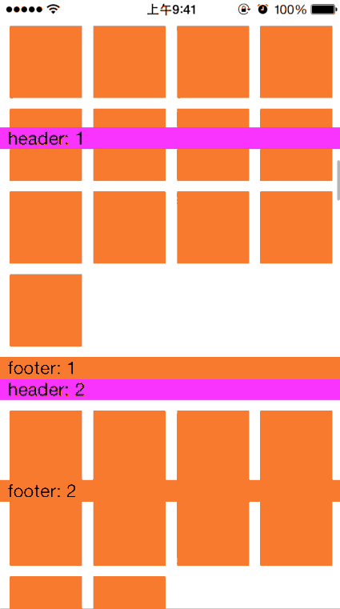

# PinnedSectionHeadersFootersLayout
PinnedSectionHeadersFootersLayout For UICollectionView

You can use this layout to achieve pinned headers and pinned footers before iOS 9.0.

In iOS 9.0+, you can also use these properties.

```
@property (nonatomic, assign) BOOL pinnedSectionHeaders;// default is YES
@property (nonatomic, assign) BOOL pinnedSectionFooters;// default is YES
```
`pinnedSectionHeaders` is a replacement of `sectionHeadersPinToVisibleBounds`.
`pinnedSectionFooters` is a replacement of `sectionFootersPinToVisibleBounds`.

```
// Set these properties to YES to get headers that pin to the top of the screen and footers that pin to the bottom while scrolling (similar to UITableView).
@property (nonatomic) BOOL sectionHeadersPinToVisibleBounds NS_AVAILABLE_IOS(9_0);
@property (nonatomic) BOOL sectionFootersPinToVisibleBounds NS_AVAILABLE_IOS(9_0);
```

